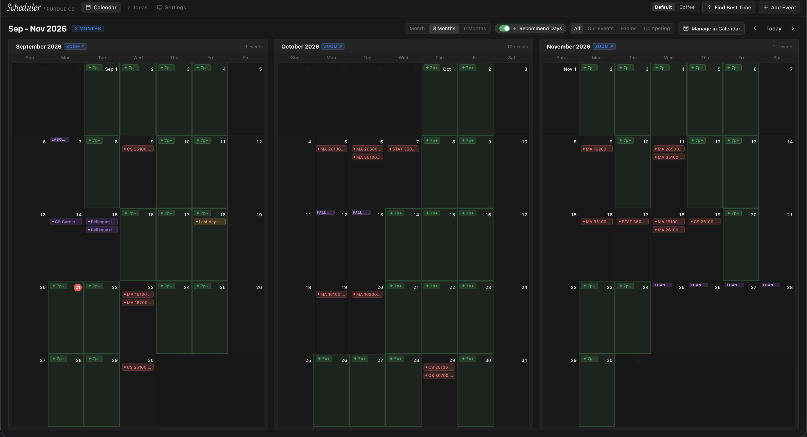

# scheduler



Casual Projects build!

A calendar for picking club event dates that do not collide with the exams your members are actually sitting. You give it the courses your audience takes, it pulls the registrar's exam table and the academic calendar, and it ranks every open evening by how many people a slot would cost you.

The usual way to schedule a hack night is five syllabi, a registrar PDF, and a guess. The guess is where it goes wrong: you land on the Tuesday before the CS 251 midterm, twelve people RSVP, four show up, and nobody can tell you afterwards which conflict did it. Scheduler makes that cost a number before you commit, so the argument for a date is something you can show the exec board instead of defend from memory.

### The Loop

1. **Set up the audience**: Add the courses your members take (CS 180, CS 251, MA 161, MA 162, MA 261, STAT 350, CS 307) with a weight for roughly how much of your audience sits in each.
2. **Pull the constraints**: Paste the registrar's exam table and it parses out the sittings; `backend/data/academic_calendar.json` supplies breaks, closures, and finals weeks as hard blackouts.
3. **Search for a slot**: Pick a duration, a weekday set, and an evening window across a 1, 3, or 6 month horizon.
4. **Read the score**: Each slot comes back with what overlaps it and what that overlap costs in attendance.
5. **Book it**: Add the event from the calendar popover, or push it and the academic layers to Google Calendar over OAuth.

### Scoring

Everything that competes for your audience becomes a weighted busy interval - a class meeting, an exam sitting, another club's event. A candidate slot is scored against every interval it touches, and two numbers come out because they answer different questions.

`blocked` is the plain sum of weights of anything overlapping at all. It answers "how many people have *something* in the way", and it is what you use to throw a slot out.

`lost_attendance` prorates each source by how much of the slot it eats. A lab covering the first third of a two-hour event costs a third of its roster, which models people arriving late rather than not coming. That is the ranking key, because it breaks the ties that `blocked` leaves.

Both over-count when one person is busy for two reasons at once. That is fine. Slots are only ever compared against each other and the bias lands on all of them about equally.

Breaks and closures are not scored, they are removed. An event cannot happen on a day the campus is shut, so those slots are never offered rather than offered with a big penalty attached.

### Parsing the registrar table

The exam schedule is an HTML table people copy-paste as text, and splitting it on whitespace does not work. CRN and section columns go blank, or hold bracketed placeholders like `[Dist]`, and the room column is an unquoted comma-separated list, so column positions shift row to row.

The parser anchors on the two columns with a rigid shape - the date and the time range - and treats everything left of them as identifiers and everything right as rooms. Blank columns and multi-room rows survive that. The registrar also emits one row per CRN and lists distance sections under a `DIST`-suffixed code that duplicates the in-person sitting, so both get collapsed on the way in.

### The password gate

There are no user accounts and there will not be any. Everyone using this is an officer of one club, and what is being protected is a term of event planning, not anything sensitive. One shared password is proportionate to that.

It exists because the API is otherwise wide open. Signing in with Google authorizes *Calendar*, not this app, so on a public URL a stranger with the link could add events and wipe the ideas board. That is the only hole it closes.

Set `SCHEDULER_PASSWORD` to turn it on. Leave it unset and the gate disappears, which is the right default for `./dev` on a laptop - nothing to type and nothing reachable from outside the machine anyway. Sessions last 30 days, signed with an HMAC derived from the password itself, so changing the password logs everybody out. That is what you want from a shared secret: revoking access means rotating it.

### Quickstart

```bash
./check    # tests, typecheck, lint
./dev      # Vite with hot reload + FastAPI
./serve    # build the bundle and serve it all from one process
```

Needs Python 3.12+ and Node 20+. `./serve` creates its own virtualenv and installs both dependency sets on first run. Google Calendar sync needs `VITE_GOOGLE_CLIENT_ID`; without it every other part of the app still works.

`./snapshot` dumps the whole database to `frontend/public/snapshot.json` as plain text, readable with no database at all.

### Storage and Architecture

State is one SQLite file. A few thousand rows of campus schedule does not need a service running next to it, and `SCHEDULER_DATABASE_URL` is the single thing to change if that ever stops being true. A copy of the file is a backup.

```
scheduler/
├── backend/
│   ├── app/
│   │   ├── core/
│   │   │   ├── scheduling.py        # busy intervals, slot scoring
│   │   │   ├── registrar.py         # exam table parser
│   │   │   └── models.py            # Course, ClubEvent, Idea
│   │   ├── auth.py                  # shared-password gate
│   │   └── main.py                  # FastAPI routes
│   ├── data/academic_calendar.json  # breaks, closures, finals
│   └── scheduler.db                 # SQLite, gitignored
├── frontend/src/
│   ├── components/                  # MonthCalendar, QuickAddEvent, GoogleSync, Ideas
│   ├── recommend.ts                 # clear-evening pass over the window
│   ├── dates.ts                     # local-timezone date math
│   └── styles.css                   # design tokens, themes
└── deploy/                          # systemd unit, cloudflared config
```

### Interface notes

Three tabs: Calendar, Ideas, Setup. The calendar switches between 1, 3, and 6 month horizons, and the recommend toggle sweeps the whole window for clear weekday evenings from 7:00 PM on. Click an empty slot to add an event with duration presets and a live time range; click an existing chip to move, edit, or delete it. Ideas is a holding pen for events with no date yet - each one has a "find time" button that hands it to the slot search.

Two themes, remembered in `localStorage`: Notion dark (`#181818`) and Coffee (`#1c1513`). `Esc` closes any open popover or modal.

### Hosting

One Python process on an always-on Linux box (`slim`), bound to `127.0.0.1`, fronted by a Cloudflare Tunnel. Nothing on the LAN can reach it except through the tunnel, and there is no port forwarded and no certificate to renew. It is password-protected, so the live link will ask you for one.

live @ [scheduler.ryhub.dev](https://scheduler.ryhub.dev/)
